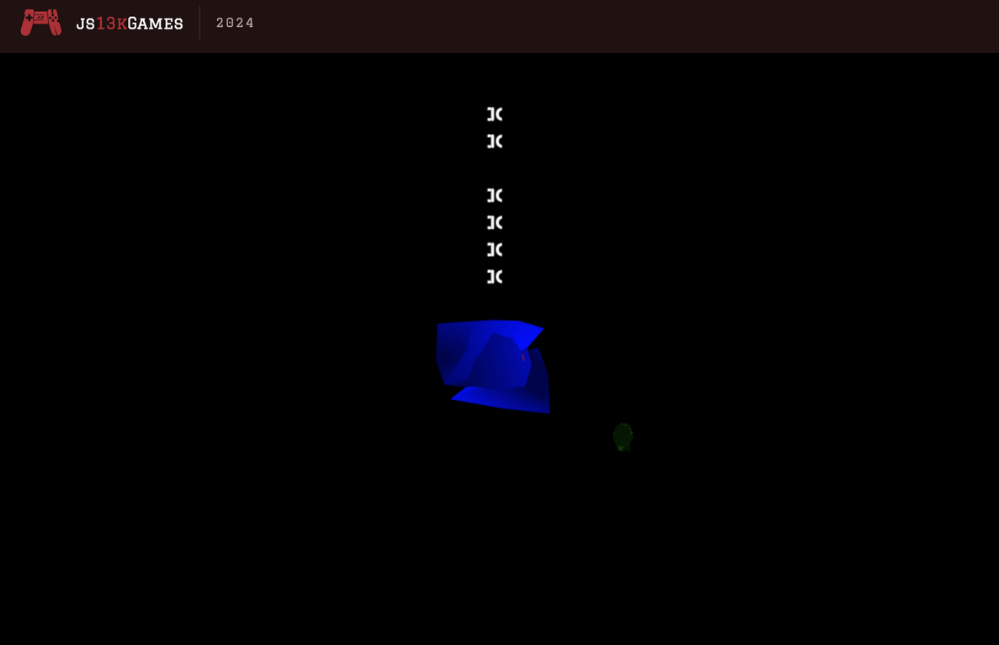

# Paraskevidekatriaphobia

I made this cute little game for [js13k](https://js13kgames.com/2024/).
The game is about helping little engineer to build a factory.

[Go, play it!](https://js13kgames.com/games/paraskevidekatriaphobia).

**P.S. to catch chicken just lie low and try not to scare it away.**

## Controls

* <kbd>W</kbd><kbd>A</kbd><kbd>S</kbd><kbd>D</kbd> to move.
* <kbd>Shift</kbd> to move faster.
* <kbd>Space</kbd> to pick up things.

## Postmortem

### How it started

At the end of august, I decided to participate in js13k. In early september, I came up with an idea for the game: it was supposed to be story-centered space horror, where the player is supposed to walk around a spaceship, collect items, hide from hungry monster(laboratory experiment #13). The spaceship was supposed to contain 13 sectors and I had already decided what would be in each of them.

Over the next couple of days, I created 3d rendering using WebGL, compact vector font format using Bezier curves, converter of this font format to SDF font, SDF font rendering, compact floating point number format(about 8 bit per number), file format for 3d meshes, model exporter for blender and preprocessor for javascript. When I finished doing all this, there were only a couple of days left before the deadline.

I realized something terrible: I didn't have enough time to implement my original idea. So I decided to cut off the least important parts of it: the spaceship and the monster. Instead of the spaceship there will be grass, instead of the monster there will be friday the thirteenth. I managed to implement the cropped idea in time and I even had time to make more dialogues and show the game to my friends. Hoverer I failed to find time to adjust things based on their feedback.

### How it was made

#### 3D model creation

All models are made in a Blender. I tried to make them low-poly and cute. I also had to make almost all of them monochrome due to limitations of my mesh format.
Some models (printer for example) have faces with wrong(flipped) normals on purpose in order to emulate having more color variation.

#### 3D model storage

All meshes are stored together in the `models.bin` file, which is generated by `export.py` Blender script.
At the start of the game this file is loaded, parsed and packed into WebGL vertex attributes.

This format is very limited, unnecessarily complex and I am not sure if it was worth creating. The file contains these data per mesh:
* sRGB color of the entire mesh (3 bytes); *It's not really sRGB, because there's no color management or gamma correction in the game. It is stored as sRGB, but is used as linear RGB... oh, wait, that's a bug :(*
* Boolean value indicating whether this mesh should be rendered smooth or flat (1 byte);
* Exponent of all following floating point numbers (1 byte); *P.S. The base of exponent here is 10/9 and not 2, because it gives more precise vertex placement, which is because of difficult to explain mathematical reasons.*
* Number of vertices in this mesh (1 byte);
* Most significant 8 bits of mantissas of each vertex coordinate (3 bytes per vertex);
* Number of faces (quads) in this mesh (1 byte);
* Indexes of vertices used in each face (4 bytes per face);

On average my format spends about `7*n` bytes to store mesh containing `2*n` triangles.
It can store no more than one color per mesh, thus multi-colored models were separated into multiple meshes and then they are put back together at runtime.
It also does not support non-quadrilateral faces, thus I had to be very careful with topology.

#### 3D rendering

My 3D rendering of meshes is pretty ordinary and does not contain any clever tricks. I shove mesh vertices and normals into vertex attributes, then I read them in shaders and display brighter color if a normal points towards the sun. I didn't use any sophisticated lighting systems or distance culling.
Normals are calculated as cross product of adjacent edge vectors. If mesh is rendered smooth, then for each vertex its normal is calculated as normalized weighted average of normals of its adjacent faces, where face area is used as weight.

On the other hand, I had a lot of problems in generating projection and View matrices. That's why the camera in the game never turns or tilts.

*P.S. It was my first time working with WebGL and I feel like it is much friendlier than GLES in Android: it gives infinitely more readable error messages when something goes wrong.*

#### Font storage

Each font character is stored as three quadratic Bezier curves, each Bezier curve is stored three control points, and the coordinates of each point are stored as two 4-bit fixed-point numbers. My font contains 36 characters, for each of which I manually selected Bezier curves and entered their coordinates into a python script that compresses them into a binary file. At initialization this file is loaded and parsed: each Bezier curve turns into a set of points, then for each pixel on a 32x64 grid distance to the nearest point of the Bezier curve is calculated. These distances are written into texture atlas with all the characters. This is how SDF font texture is generated.
Then, when I need to print some character, I just render a piece of this texture.

#### 2D rendering

I use 2D rendering exclusively to render dialogues, thus it is assumed that the rendered texture contains SDF and not the color.
2d quadrilaterals are rendered using PWM matrices from 3D rendering, this allows me to use the 3d position of any object to render text over/above it. Vertex coordinates become offsets from the pivot point in the vertex shader. And the fragment shader reads from the SDF texture and uses it to render only those pixels that are very close to edges of glyphs.

#### Sound

I am shocked by what other people are doing in this gamejam: they somehow fit whole MIDI players into a couple of kilobytes (or even bytes).
I also want to do something like that, but I can't do that. Not yet. Therefore, I decided to go without sound, but next time I will definitely try to make something loud.

#### Plot

Because of not having enough time the plot of this game is much shorter than originally intended, but I still like it.
According to the plot, player helps a cute little engineer build a lasagna generator by bringing various building materials.
The game is very short and player needs to bring literally like five items to finish the game.
At the very beginning of the game, the player must catch and bring a chicken to the engineer.
It(game, not chicken) is full of cute funny dialogues and plot twists, so it is supposed to give players a **short but pleasant experience**.

The whole plot is implemented as a huge `async` function that does everything:
moves characters, shows dialogues, turns on/off intelligence of entities, `awaits` for fulfilment of conditions before continuing going through the plot.
This approach is very simple and allows me to add plot twists in a couple of lines of code, which is really nice, but the code itself looks so ugly that even my LSP complains about its ugliness.

### How it went

It went terrible. The game turned out to be very buggy:
* On most video cards, the game looks as in the image above. And no, it is not supposed to look like that: the blue mess at the image above was supposed to be a human being!
* Due to incorrect handling of screen aspect ratio all text either becomes very wide or thin if aspect ratio is not 16:9.
* The dialogue is often displayed not above the speaking character, but below it.
* The main character's legs often become invisible.
* The same problem with eyes, but because of different bug.
* Some characters(including main character) forget which way they are facing when they stop moving.
* Due to misplacement of some objects, the engineer often asks for help to get to the construction site while already being inside the construction site.
* Duo to incorrect handling of SPACE picking up an object immediately throws it away on some keyboards.
* A few more. I think I might even get a prize for making the most buggy game in this year.

But there is good news: the vast majority of players have not noticed any bugs. Just look at their feedback:

> There's a chicken but I am unable to catch it. I have no idea what I'm supposed to do.
> -- Expert #1

> The chicken ran away so fast, then the chicken came back but ran away so much faster than my character could ever move.
> -- Expert #2

> Chicken
> -- Expert #3

> Chicken is nowhere to be found, I didn't last long in the game.
> -- Gamedev #1

> I couldn't find the chicken so couldn't progress very far.
> -- Gamedev #2

> A chicken ran away. Then I couldn't find it.
> -- Gamedev #3

> I never did find the chicken - I'm still looking.
> -- minecraft grass block

> I could not find the chicken. I saw the chicken, but the it disappeared.
> -- Gamedev #5

> The chicken chase was weird -- the chicken always stayed out of reach.
> -- Gamedev #6 <- this guy rocks btw

> I caught a chicken, but could not find the construction site...
> -- azkaban prisoner

P.S. I didn't write the names for privacy reasons, but all the reviews are real and can be found [at this page](https://js13kgames.com/2024/games/paraskevidekatriaphobia).

### What I learned

* Writing a post-mortem in my non-native language is quite tedious.
* The game should be playable as early as possible in order to have time to change something based on feedbacks.
* The game should be playtested by as many people as possible to get maximum amount of feedback to work with.
* I should aim small when designing the game, otherwise I will run out of time before running out of bytes.
* Code is usually very well compressed and its size is not a limiting factor, so I should primarily write readable refactorable code rather than compact.
* MORE PLAYTESTING!
